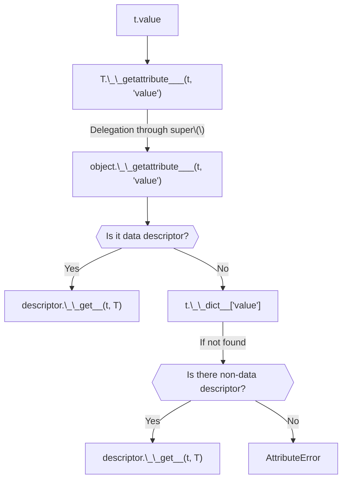

Descriptors are everywhere in Python. If you've ever written a class with a
method, used the `@property` decorator, or used an ORM library like `sqlalchemy`,
congrats! You've used a descriptor.

Descriptors allow us to manipulate what happens during attribute access on an
object. 

## The interface

A user of our file finder would write code that looks like this:

```python
from file_finder import FileFinder
from file_finder import Glob
from file_finder import Regex


class InputFileFinder(FileFinder):
    portfolio = Glob("PTF_{date}.csv").first()
    trial_balance = Glob("TB_{date}.csv").first()
    transactions = Regex("TRANS_[A-Z]{{2}}_{date}.csv").all()


finder = InputFileFinder("./input_files", templates={"date": "20260430"})

print(f"{finder.portfolio = !r}")
# finder.portfolio = PosixPath('input_files/PTF_20260430.csv')

print(f"{finder.trial_balance = !r}")
# finder.trial_balance = PosixPath('input_files/TB_20260430.csv')

print(f"{finder.transactions = !r}")
# finder.transactions = [
#   PosixPath('input_files/TRANS_AA_20260430.csv'),
#   PosixPath('input_files/TRANS_AB_20260430.csv'),
# ]
```

The class defines our specifications, i.e. the file names and whether we want
to get a single file or all matched files, and the objects built from that class
resolve these specs against a root directory. The user is also allowed to 
use **template strings** in her specs, and provide it when constructing the object.
Finally, the found paths can be retrieved directly through the object attributes.

This is quite a compact way to write specs and access file paths, but it doesn't
have to stop there. For example, we could use this way of writing file finders
to also tack on some post-processing steps on the matched files. For example,
if we want our spec to dictate that there should be at least two transactions
files, then we could replace the `transactions` attribute with:

```python
class InputFileFinder(FileFinder):
    # ...
    transactions = (
        Regex("TRANS_[A-Z]{{2}}_{date}.csv")
        .assert_len_at_least_n(2)
        .all()
    )
```

Writing specifications in code rather than a pure data format like JSON allows
us to include more complex/custom logic, like the following filter:

```python
class InputFileFinder(FileFinder):
    # ...
    transactions = (
        Regex("TRANS_[A-Z]{{2}}_{date}.csv")
        # Only files above 1MB
        .filter(lambda p: p.stat().st_size > 1_048_576)
        .assert_len_at_least_n(2)
        .all()
    )
```

Let's look on how to build it!

## Matching strategies

A **Matching strategy** is what we use to find files. In our example above, we
use two strategies: `Glob` and `Regex`. 

Implementing a new matching strategy is simple, it needs to be a class that
implements 

```python
class MatchingStrategy(metaclass=MatchingStrategyMeta):
    def __init__(self, processors: list[Processor] | None = None):
        self._name = None
        self._processors: list[Processor] = processors or []

    def __repr__(self) -> str:
        return f"{self.__class__.__name__}()"

    def find_files(
        self, dir_: pathlib.Path, templates: dict[str, str]
    ) -> Iterator[pathlib.Path]:
        raise NotImplementedError
```


## Matching strategies defined as descriptors

When dealing with file finders, we have a **spec/value duality**. Specs can be
accessed from the class that defines them, and the found file paths can be
accessed from the instantiated finder object. 

```python
print(f"{InputFileFinder.portfolio = !r}")
# InputFileFinder.portfolio = TerminatedMatchingStrategy(strategy=Glob(glob='PTF_{date}.csv', recursive=False), terminator=<function MatchingStrategy.first.<locals>._inner at 0x109e67e20>)

print(f"{finder.portfolio = !r}")
# finder.portfolio = PosixPath('input_files/PTF_20260430.csv')
```

This is reminiscing of the pattern used by **Object Relational Mappers**, like
`sqlalchemy`, where the class defines the spec of a database table, but objects
created from this class represents rows in said table.


## Object Relational Mappers

Object Relational Mappers ("ORMs") are libraries that allow us to define object **schemas**
which describe the tables in a database, and use these schemas to build objects
that represent each row in said table. Generally, this is done in a compact way,
with a class representing the schema, and the instances of the class representing
the rows.

Shown below is how a barebones `users` table is specified using the `sqlalchemy`
ORM. The class defines **class attributes**, which are `InstrumentedAttribute` objects,
but these attributes also exist on instances, but this time, hold the data itself. 

```python
from sqlalchemy import String
from sqlalchemy.orm import DeclarativeBase
from sqlalchemy.orm import Mapped
from sqlalchemy.orm import mapped_column

class Base(DeclarativeBase):
    pass

class User(Base):
    __tablename__ = "users"

    id: Mapped[int] = mapped_column(primary_key=True)
    name: Mapped[str] = mapped_column(String(30))

print(f"{User.name = }")
# User.name = <sqlalchemy.orm.attributes.InstrumentedAttribute object at 0x10b4787c0>

user = User(id=1, name="Maxime")
print(f"{user.name = }")
# user.name = 'Maxime'
```

```note
Note that `sqlalchemy` also defined the `__init__` method for our table class 
for us, based on our class attributes.
```

## What are descriptors?

In Python, we call a **non-data descriptor** any object that defines a `__get__` method. 
Objects that additionally define either a `__set__` or a `__delete__` method are called 
**data descriptors**. As indicated by their names, these methods are involved in
the retrieval, setting and deletion of attributes.

To illustrate how `__get__` could be called, let us take a look at a simplified
flowchart representing what happens when we try to access an attribute named `value`
on an object called `t` of type `T`.



```note
We assume that `T` does not define `__getattr__`, on which `__getattribute__`
would fall back if no value was found upon lookup.
```

As shown in the flowchart, it is `object.__getattribute__` that finds and
invokes descriptors used throughout our class attributes.

**What makes descriptors useful is that they allow us to control how attributes
get accessed, set and deleted, without having to modify the objects that use
these attributes.** As such, they allow library authors to provide a great deal
of convenience to their users, without needing them to lift a finger.

Below is the most basic example of the use of a descriptor:

```python
from typing import Any

class Value:
    def __init__(self, v: Any) -> None:
        self.v = v

    def __get__(self, obj, type=None):
        print(f"__get__ called with {obj=} and {type=}")
        return self


class SomeClass:
    value = Value(10)


SomeClass.value
# Prints:
# __get__ called with obj=None and type=<class '__main__.SomeClass'>

SomeClass().value
# Prints:
# __get__ called with obj=<__main__.SomeClass object at 0x109e3c590> and type=<class '__main__.SomeClass'>
```

What this simple example shows us is that we can now have the attribute access
do something different based on the object/type that holds said attribute.

A common use case


## A file finder

Let us build something 